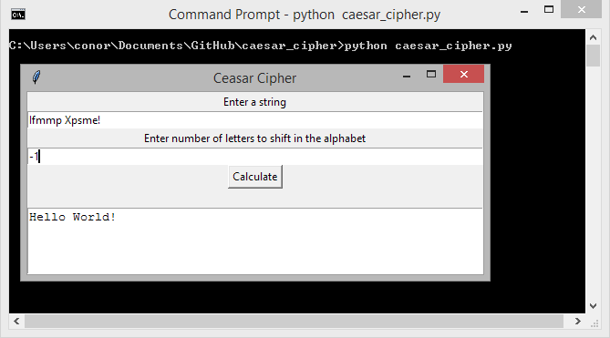

[](https://github.com/ConorSheehan1/caesar_cipher/actions/)
[](https://opensource.org/licenses/MIT)

# Requirements
1. All you need is python3 and tkinter. You can download python 3 here: [https://www.python.org/downloads/](https://www.python.org/downloads/)

# Usage
Run ```python3 src/ui.py```. You should see something like this: 
  


The program ignores everything other than characters in the Latin alphabet ```[a-zA-Z]```.

It is possible to shift the text either direction. For example shifting text back 1 letter (-1) is equivalent to moving the text forward 25 letters (25). This also makes it easier to reverse ciphers. If you already know how many letters a piece of text is shifted forward, put a minus in front of that number to unscramble the text.  
 


# Development
Installation:  
```
pip install pipenv
pipenv install --dev
```

Tests:  
```pipenv run test```

Linter:  
```pipenv run lint```


